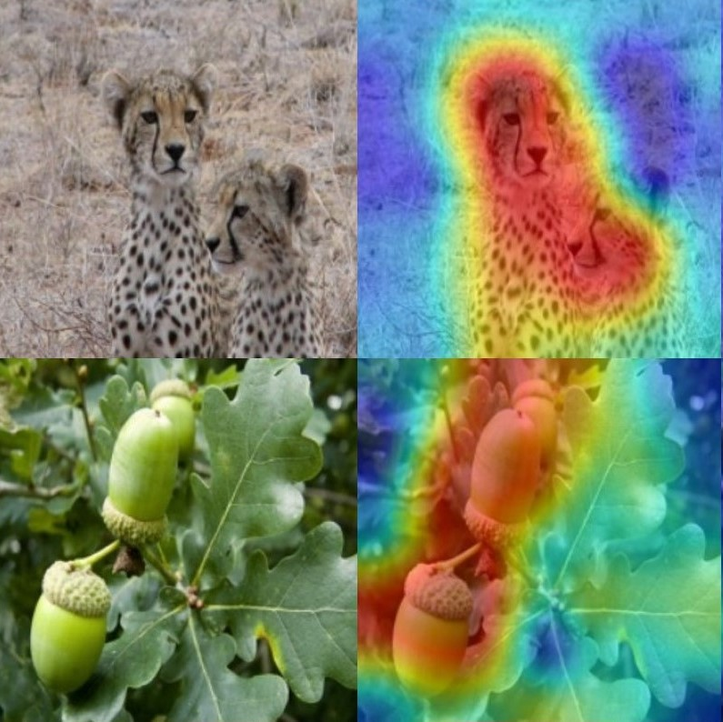

# Baseline Exploration-Exploitation

We introduce a novel method that enables visualization of predictions made by vision models, as well as visualization of explanations for a specific class.
In this method, we present the concept of baseline exploration-exploitation.

## Description
This repository is an official PyTorch implementation of the Baseline Exploration-Exploitation (BEE) method.

## Saliency Map Generation
Images should be stored in the `imgs\ILSVRC2012_img_val` directory. 
The information on the images being evaluated and their target class can be found in the `imgs\pics.txt` file, with each line formatted as follows: `<file_name> target_class_number` (e.g. `ILSVRC2012_val_00002214.JPEG 153`).

To generate saliency maps using our method, use `map_generator.py`.
The generated saliency maps will be stored in the `visual_results` directory.

ViT models weight files can be found in the following links: [ViT-B](https://github.com/rwightman/pytorch-image-models/releases/download/v0.1-vitjx/jx_vit_base_p16_224-80ecf9dd.pth), [ViT-S](https://github.com/rwightman/pytorch-image-models/releases/download/v0.1-weights/vit_small_p16_224-15ec54c9.pth).

For comparison, we used code from the [pytorch-grad-cam](https://github.com/jacobgil/pytorch-grad-cam) and [saliency](https://github.com/PAIR-code/saliency) git repositories.

## Examples

  

